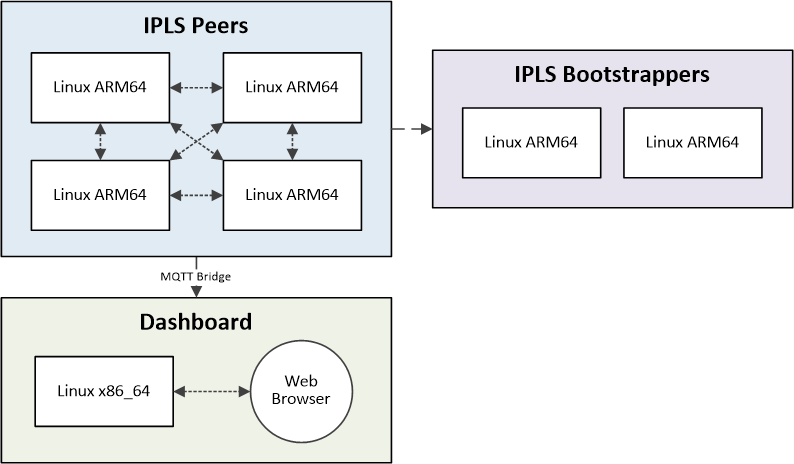

# IPLS Anomaly Detection Setup

Technica’s fog-as-a-service platform previously included Anomaly Detection that utilized Federated Learning.  Federated Learning allows models to continuously learn and train locally, then share new knowledge with other devices.  We have replaced Federated Learning with IPLS to decentralize the processes of model training and convergence, weight aggregation, and weight redistribution. 
The result is improved data privacy, performance, and elimination of single points of failure.  This repository contains a new Anomaly Detection solution utilizing IPLS.

Below is the architecture for this solution:



- IPLS Bootstrappers:

  - You need at least one device, but can use as many as you want
    - Having more than one will eliminate a single point of failure
  - Containers are Docker or Singularity
  - Tested on Jetson Nano (Linux ARM64) 

- IPLS Peers:

  - Four devices are recommended, but you should have at least two
  - Containers are Docker or Singularity
  - Tested on Raspberry Pi 4 (Linux ARM64)

- Data Generators:

  -  One for each IPLS Peer
     -  Setup is simpler if data generators are on the same device as their Peers, but is not required
  -  Containers are Docker
  -  Tested on Raspberry Pi 4 (Linux ARM64)

- Frontend

  - You need one device separate from the Peers

  - Container is Docker

  - Tested on Linux x86_64


------


## Initial Setup

On each of the devices, pull down the repository:

```bash
git clone https://github.com/Technica-Corporation/ipls_anomaly_detection.git
```

```bash
cd ipls_anomaly_detection
```

------


### Compile IPLS Java API

This step will compile the IPLS Java API that was edited by Technica; it is from the Github Repository [IPLS-Java-API](https://github.com/ChristodoulosPappas/IPLS-Java-API) by ChristodoulosPappas. You may want to read the included presentation pdf to get a better understanding on how IPLS itself works.

The repository is included here as we have made a few changes:

- Everything in the 'default' package was moved into a new package called 'originalDefault'

- AnomalyDetectionDriver.java added to the 'default' package

- An 'anomalydetection' package was added which includes all our code for IPLS Anomaly Detection

- In the pom.xml the version for deeplearning4j and nd4j was upgraded to 1.0.0-M1.1

  > **_NOTE:_**  The previous version pulled in a specific version of OpenBlas that has a bug on Arm64 platforms causing calculations to sporadically result in NaN.


From ipls_anomaly_detection, navigate to compile_container:

```bash
cd compile_container/
```

```bash
sh build_container.sh
```

```bash
sh run_docker.sh -l
```

> **_NOTE:_**  run_docker.sh -l will copy the .jar file and a directory of libs/ to ipls_anomaly_detection/resources. 
>
> Running it without the -l flag will stop it from copying the libs; these are needed, but it can take a while on small devices. You may want to run it with the flag once to generate them libs and then remove the flag for subsequent builds of the IPLS jar.
>
> **_Recommendation:_** Once compiled, look into ipls_anomaly_detection/resources/libs. The Maven build will include dependencies for multiple platforms; manually delete the ones you don't need to reduce the size of the containers.

------


### Build the Base Container

This step will build the base container for the IPLS Bootstrapper and IPLS Peer containers. It is built on openjdk:8u302-jre-slim-buster and contains go and go-IPFS along with a few other required system libraries.

From ipls_anomaly_detection, navigate to base_container:

```bash
cd base_container/
```

```bash
sh build_container.sh
```

------


## Build the IPLS Bootstrapper Containers

This step will build the IPLS Bootstrapper Container and must be run on all Bootstrapper Devices.

> **_NOTE:_**  You only need to build this on the Bootstrapper Devices, it does not need to be built on the Peer Devices.

There is really only one difference between the Bootstrapper and Peer containers, but it is a big one. The Bootstrapper Container will `init ipfs` as part of the Docker Build to ensure the IPFS Peer ID of the Bootstrapper remains constant for the Peer configurations. The Peers on the other hand will `init ipfs` when the containers are run, getting a new IPFS Peer ID each time.

------

### Docker Version

From ipls_anomaly_detection, navigate to bootstrapper_container:

```bash
cd bootstrapper_container/
```

```bash
sh build_container.sh
```


After the container is built, get the container's IPFS Peer ID:

```bash
sh get_peerid.sh
```


This will result in console output that looks something like this:

```bash
----------
BOOTSTRAPPER_PEERID:
12D3KooWHtpV9iqWJQrXCr95Foe5tpgiVih5YFXNeyVPUknVvAw8
----------
BOOTSTRAPPER_ADDRESS:
/ip4/192.168.56.55/tcp/4001/ipfs/12D3KooWHtpV9iqWJQrXCr95Foe5tpgiVih5YFXNeyVPUknVvAw8
----------
```

> **_NOTE:_** The IDs above are just examples, it is very unlikely that yours will be the same

Copy the BOOTSTRAPPER_PEERID and BOOTSTRAPPER_ADDRESS; you will need these to configure the Peers.

> **_NOTE:_** The configuration file at ipls_anomaly-detection/bootstrapper_container/resources/adconfig.json is used when the bootstrapper container is run and should not need to be changed.

------

### Singularity Version

This is an optional step and will copy the Docker container and convert it to Singularity; it requires the Docker container step above to be complete before proceeding.

From ipls_anomaly_detection navigate to bootstrapper_container/singularity:

```bash
cd bootstrapper_container/
```

```bash
sh convert_to_singularity.sh
```

> **_NOTE:_** This will take a long time. The conversion saves the Docker container to a tar, converts it to a .sif file and then uses that as a base to build the final Singularity container.

This will put bootstrapper.sif into the directory ipls_anomaly_detection/bootstrapper_container/singularity.

This container will have the same Peer ID as the container built in the Docker step; use the same ID when configuring Peers. This container will also use the adConfig.json from the Docker Version step.

------


## Build the IPLS Peer Containers

This step will build the IPLS Peer Container and must be run on all Peer Devices.

> **_NOTE:_**  You only need to build this on the Peer Devices, it does not need to be built on the Bootstrapper Devices.

------

### Docker Version

From ipls_anomaly_detection, navigate to peer_container:

```bash
cd peer_container/
```

```bash
sh build_container.sh
```


After the container is built, you will have to adjust the configurations.

From ipls_anomaly_detection, navigate to /peer_container/resources:

```bash
cd peer_container/resources
```

Recall the values you used on the Bootstrapper Containers' `get_peer_id.sh` and use those values here for ${BOOTSTRAPPER_ADDRESS} and ${BOOTSTRAPPER_PEERID}. 

These are lists, so you should add a value for each bootstrapper node you are using.

Select a ${NODE_NUMBER} for each Peer device; this number will be used to by the Frontend to identify each Peer. The Frontend is configured to listen for 1, 2, 3 and 4.

Edit the file 'adConfig.json':

```bash
{
    "modelPath" : "/workspace/ad_ipls_params",
    "scalerPath" : "/workspace/scaler",
    "mqttProtocol" : "tcp://",
    "mqttBrokerip" : "0.0.0.0",
    "mqttPort" : "7883",
    "mqttSubTopic" : "vehicle/${NODE_NUMBER}",
    "mqttPubTopic" : "v${NODE_NUMBER}/anomaly", 
    "ipfsAddress" : "/ip4/127.0.0.1/tcp/5001",
    "ipfsBootstrapperAddresses": [
        "${BOOTSTRAPPER_ADDRESS}"
    ],
    "ipfsBootstrapperIds" : [
        "${BOOTSTRAPPER_PEERID}"
    ],   
    "iplsIsBootstrapper" : "false",
    "peerDataisSynchronous" : "false",
    "epochs" : "3",
    "learningRate" : "0.001",
    "iplsModelPartitions" : "8",
    "iplsMinPartitions" : "2",
    "iplsMinPeers" : "1",
    "updateFrequency" : 32,
    "stabilityCount" : 5
}
```

------

### Singularity Version

This is an optional step and will copy the Docker container and convert it to Singularity; it requires the Docker container step above to be complete before proceeding.

From ipls_anomaly_detection, navigate to peer_container/singularity:

```bash
cd peer_container/singularity
```

```bash
sh convert_to_singularity.sh
```

> **_NOTE:_** This will take a long time. The conversion saves the Docker container to a tar, converts it to a .sif file and then uses that as a base to build the final Singularity container.

From ipls_anomaly_detection navigate to peer_container/singularity.

This container will also use the adConfig.json from the Docker Version step.

------


## Build the Frontend Container

This will build the frontend container; this build is only for Docker on Linux x86_64.  

From ipls_anomaly_detection, navigate to frontend:

```bash
cd frontend/
```

```bash
sh build_container.sh
```

> **_NOTE:_**  If you need to adjust anything for MQTT, the configs are at frontend/resources/mosquitto.conf and frontend/config.js. This should only happen if there are port conflicts.

------


## Build the Data Generator Containers

This will build a container that will continuously publish either "normal" or "anomaly" data to the IPLS Peer Containers. It will also setup an MQTT container to act as a broker for each IPLS Peer. You will need to build this on each of the Peer Devices. This is build is for Docker on Linux ARM64 only.

From ipls_anomaly_detection, navigate to data_generator:

```bash
cd data_generator/
```

```bash
sh build_container.sh
```

------

### Adjust Configurations

From ipls_anomaly_detection, navigate to data_generator/resources:

Edit "mosquitto.conf":

```bash
####### MQTT Insecure
port 7883
bind_address 0.0.0.0
allow_anonymous true
####### 

max_queued_messages 20000

connection cloud-bridge_0
address ${FRONTEND_IP}:1883
topic # out 1 "" ""
```

- Change ${FRONTEND_IP} to the IP of the Frontend


Edit "generators.conf":

```bash
#Local MQTT broker configuration
[mqtt]
host=0.0.0.0
port=7883
pub_topic=vehicle/${NODE_NUMBER}

[service]
publish_interval=.25
total_runtime=0
normal_file=/workspace/data/${NORMAL_DATA}
anomaly_file=/workspace/data/${ANOMALY_DATA}
```

- Change ${NODE_NUMBER} to the one used in the previous step on each Peer Device
- Change ${NORMAL_DATA} and ${ANOMALY_DATA}  to the file names in ipls_anomaly_detection/resources/data.

>**_NOTE:_**  There are four files each for "normal" and "anomaly" data; you may use any data on any device so long as you use normal for normal and anomaly for anomaly.
>
>With four of each type, each Peer device can use different normal/anomaly files from each other.

------


## Demonstrating the Solution

1. From ipls_anomaly_detection, navigate to frontend on the Frontend Device

   ```bash
   sh run_docker.sh
   ```

   > **_NOTE:_** This will also start an mqtt container.
   >
   >  If you need to restart MQTT: 
   >
   > ```bash
   > docker stop ipls_mqtt
   > ```
   >
   > ```bash
   > docker stop ad_gui
   > ```
   >
   > and then start the frontend again:
   >
   > ```bash
   > sh run_docker.sh
   > ```

   Open a browser and navigate to `http://${FRONTEND_IP}:5601/`

   

   At the top of the page click the tab titled "Anomaly Detection"

2. Start the Bootstrapper Containers;

   - Docker Version:

     - From ipls_anomaly_detection, navigate to bootstrapper_container on the Bootstrapper Devices

       ```
       sh run_docker.sh
       ```

       > **_NOTE:_**  To detach without killing the container: **CTRL+p** then **CTRL+q**
       >
       > To view the running container logs: **`docker container logs -f ipls_test_peer`**

   - Singularity Version:

     - From ipls_anomaly_detection, navigate to bootstrapper_container/singularity on the Bootstrapper Devices

       ```
       sh run_singularity.sh
       ```

       > **_NOTE:_**  You may also run the container in the background as an instance via: 
       >
       > **`sh start_instance.sh`** and **`sh stop_instance.sh`**
     
     > **_NOTE:_** The terminal for this container will should read 'Daemon is ready' before it runs the Java code, and then several lines of 'Updater Started...' and 'java.util.concurrent.ForkJoinPool'
     >
     > This will signal that the Bootstrapper is properly running and waiting for Peers to join

3. From ipls_anomaly_detection, navigate to data_generator on the Peer Devices

   ```bash
   sh mqtt.sh
   ```

   > **_NOTE:_** 
   >
   > Running the script when a MQTT container **is not** running will **start** the container.
   >
   > Running the script when a MQTT container **is** running will **stop** the container.

4. Start the Peer Containers:

   -  Docker Version:

      - From ipls_anomaly_detection, navigate to peer_container on the Peer Devices

         ```
         sh run_docker.sh
         ```

         > **_NOTE:_**  To detach without killing the container: **CTRL+p** then **CTRL+q**
         >
         > To view the running container logs: **`docker container logs -f ipls_test_peer`**

   - Singularity Version:

      - From ipls_anomaly_detection, navigate to peer_container/singularity on the Peer Devices

         ```
         sh run_singularity.sh
         ```

         > **_NOTE:_**  You may also run the container in the background as an instance via:
         >
         > **`sh start_instance.sh`** and **`sh stop_instance.sh`**
      
      > **_NOTE:_** The terminal for this container will should read 'Daemon is ready' before it runs the Java code, and then 'Connected to tcp://0.0.0.0:7883 with client ID' and 'Subscribing to topic "vehicle/1" qos 1'.
      >
      > At that point the Peers are joined in to IPLS and waiting for data. 

5. From ipls_anomaly_detection, navigate to data_generator on the Peer Devices

   ```bash
   sh run_docker.sh -n
   ```

   > **_NOTE:_**  The "-n" flag will publish normal data, while the "-a" flag will publish anomaly data 

   Once the data is flowing you will see the error scores being published back to the Frontend.

   

As shown here, Vehicle 4 is using "normal" data so the blue line, the error scores, will be below the yellow line. The other three vehicles are using "anomaly" data.

The general "flow" for the demonstration is usually to start all four devices on normal data then swap one to anomaly data and let it train for a several minutes.


After the blue error score line to dips back below the yellow line, swap one or more of the other vehicles to anomaly data. Here you will notice that their error score lines do not spike like the first one did due to the training done on the first device and sharing of model gradients via IPLS.


> **_NOTE:_**  If you terminate a Peer container, it will break the training of the other Peers; this is due to a bug with the IPLS code. vYou will need to terminate the rest of the containers, then start them again to proceed.
>
>  If a new Peer joins after some initial Peers have been training for a bit, you might observe an error score spike on the initial Peers; this is due to a bug with the IPLS code.  That spike is not persistent and will return to normal after the models update again.
